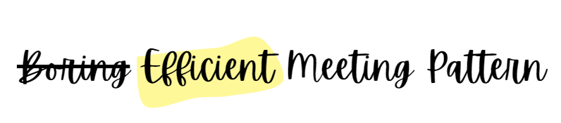

 

# Efficient Meeting Pattern - EMP  v0.2

[Subscribe to updates](https://subscribepage.io/efficientmeeting)

## Why?

> 90 percent of employees feel meetings are "costly" and "unproductive" 

"Status" meetings are a *waste of time* and *extremely costly* for the company.

    A 1-hour meeting with 4 people = 4 hours spent
    An all-hands meeting of 2 hours with 40 people = 80 hours = 10 days spent

**The Efficient Meeting Pattern aims to reduce by four times the time spent on "status" meetings**

## How does it work?

EMP is like an application that offers several levels of features. It can also be compared to a physical or sporting activity where there are different levels based on each person's skill.

## Modules

The principle revolves around a central module that is enriched with satellite modules depending on our level of expectation and maturity.

## How to start?

Efficient Meeting Pattern follows a logic of transformation. It is therefore recommended to gradually start applying the principles and increase the [level](#3-levels) as the team becomes more engaged.

Below are the details of the [3 EMP levels](#3-levels).

## 3 levels

| *Features* | Level 1 - The Minimalist  | Level 2 - The Perfectionist  | Level 3 - The Nerd  |
|:--|:--:|:--:|:--:|
| **Before the meeting** | | | |
| Apply the [efficient meeting pattern](#the-pattern) | ✓ | ✓ | ✓ |
| Share the topic to be discussed, the goal of the discussion, and the success criteria | ✓ | ✓ | ✓ |
| Share status elements in a known, shared, and archivable place (OneNote, Loop, Notion…) | ✓ | ✓ | ✓ |
| Share documents to read/know to effectively conduct the meeting | ✓ | ✓ | ✓ |
| Share concepts to know to effectively conduct the meeting | ✓ | ✓ | ✓ |
| Respond YES to invitations if I can/must attend | ✓ | ✓ | ✓ |
| Respond NO to invitations if I am absent/on leave/sick | ✓ | ✓ | ✓ |
| Cancel my meetings if I am absent/on leave/sick | ✓ | ✓ | ✓ |
| Do not have "unanswered" meetings in the calendar | ✓ | ✓ | ✓ |
| Take 5 minutes at the end of the week to review the meetings for the following week and check for conflicts | ✓ | ✓ | ✓ |
| Use the "mandatory" and "optional" features when scheduling the meeting | ✓ | ✓ | ✓ |
| Delay the start of the meeting by 5 minutes |  | ✓ | ✓ |
| Shorten the meeting by 10 minutes |  | ✓ | ✓ |
| Take 5 minutes at the end of the day to review the meetings for the next day and check for conflicts |  | ✓ | ✓ |
| Take 5 minutes in the middle of the day to prepare for the meetings of the next day |  |  | ✓ |
| **During the meeting** | | | |
| Apply the [efficient meeting pattern](#the-pattern) | ✓ | ✓ | ✓ |
| Be on time for meetings | ✓ | ✓ | ✓ |
| Postpone the meeting if the "mandatory" participants are not present | ✓ | ✓ | ✓ |
| Ensure that time is managed (timekeeper) |  | ✓ | ✓ |
| Come prepared to the meetings |  | ✓ | ✓ |
| **After the meeting** | | | |
| Share the minutes of the meeting | ✓ | ✓ | ✓ |
| Share and assign the task list | ✓ | ✓ | ✓ |
| Share the next steps | ✓ | ✓ | ✓ |
| Add your todos on your personal task management system (if applicable) |  | ✓ | ✓ |

## The pattern

### Sequence

1. **Prepare** your meeting
2. **Send** the invitation including all details following the [template](#meeting-template)
3. **Share** status on the shared document **asynchronously**
4. **Conduct** the meeting

### Meeting agenda & timing
- 5 minutes for Introduction
- 10 minutes for Q&A and potential alerts
- *(Optional)* 30 minutes for collaboration

### Templates

#### Sharing document template

This document is used to share all updates prior to the meeting so that participants can focus on the essentials during the discussion. 

Participants should update and read this document before the meeting.

*You can copy/paste this template and update & remove according to your needs.*

---

> **Date:** [Insert date here]
> 
> **Participants:** [Insert list of participants here]
> 
> **Updates:**
> - [To be updated] 
> - List item
> - List item
> - ...
> 
> **Alerts:**
> - [To be updated]
> - List item
> - List item
> - ...
> 
> **Minutes of the meeting:**  [To be updated]
> 
> **Todolist**:
> 
>  - [ ] [To be updated]
>  - [ ] List item
>  - [ ] List item
> 
> **Next steps:**
>   - [ ] [To be updated]
>  - [ ] List item
>  - [ ] List item

---

#### Meeting template

It is important to mention that **the invite must be read before** the meeting (in the meeting's title).

*You can copy/paste this template and update & remove according to your needs.*

---

> **Meeting title :**  [An explicit and attractive title] - Read this before the meeting
> 
> **Collaboration topic(s):**
>    - Topic 1
>    - Topic 2 (if required/possible)
>    
> **Objective:**  [A clear sentence explaining the objective of the discussion]
> 
> **Documents:**
> - List all the necessary documents for the meeting (attached to the invite or link included)
> 
> **Updates:**  Please share your updates on this document before the meeting:  [insert link here]
> 
> **Agenda [Example, to be updated]:**
> - 5 minutes for Introduction
> - 10 minutes for Q&A and potential alerts
> - 30 minutes for collaboration
> 
> **Methodology:**  I'm following the [Efficient Meeting Pattern](https://efficientmeeting.lamouche.fr/) to reduce the time
> spent in non-productive meetings. You can find all the details and
> documentation about [EMP on this
> page](https://efficientmeeting.lamouche.fr/).
> 
> 
> 
>  
> 
> 
>  
>  
> 

---

In case there is no immediate need to collaborate on a specific topic, you can skip the last 30 minutes of the meeting.

## How to communicate and get adhesion from your team?

Explain the "Why," the starting point, the foundation. The idea is not to add something or propose a "new reorganization." The core of the subject is the meaning of our work and the waste of our resources.

Lead by example. Probably the best way to prove the model's viability.

Communication. Include the image of your badge in your invitations; this should spark curiosity and perhaps even debates.
We have two sets of badges to choose from according to your preferences (copy/paste):

 
 
 

 
 
 

## Library & inspiration

- **Death by Meeting** by *Patrick Lencioni*
	- Constructive Conflict: Encourage open debates and constructive disagreements to engage participants and arrive at well-thought-out decisions.
	- Meeting Structure: Divide meetings into different types (daily, weekly, monthly, quarterly) to address specific needs and avoid redundancy.
	- Dramatic Narration: Apply storytelling techniques to make meetings more engaging and relevant.

- **The Secrets of Facilitation** by *Michael Wilkinson*
	- Meticulous Preparation: Successful meetings begin long before they are held, with thorough preparation by the facilitator.
	- Group Dynamics Management: Use techniques to manage the different dynamics and personalities in the room.
	- Post-Meeting Actions: Ensure actions and decisions are clearly established and followed up after the meeting.

- **Read This Before Our Next Meeting** by *Al Pittampalli*
	- Decision Culture: Change the organizational culture so that meetings are primarily decision-making places, not just discussions or reports.
	- Less, but Better: Have fewer meetings but of higher quality, where each meeting has a clear and precise purpose.
	- Mandatory Preparation: Require all participants to come prepared to contribute effectively to the meeting.

- **Getting Things Done** by *David Allen*
	- Clarification of Actions: Ensure that each discussion point leads to a clear action, with a responsible person and a deadline.
	- Regular Reviews: Hold regular reviews to track the progress of actions decided during meetings.
	- Information Organization: Keep information organized so that relevant data is easily accessible during the meeting.

- **Where the Action Is** by *Elise Keith*
	- Meeting System: Develop a comprehensive meeting system that supports the organization's strategic goals.
	- Clear Roles: Assign specific roles in meetings to improve flow and structure (e.g., facilitator, note-taker).
	- Continuous Feedback: Integrate feedback to continually improve the structure and content of meetings.
- **Dear Manager, You’re Holding Too Many Meetings** by *Benjamin Laker, Vijay Pereira, Ashish Malik, and Lebene Soga* - [Link](https://hbr.org/2022/03/dear-manager-youre-holding-too-many-meetings) 
- **Hate Meetings? Considerable Research Reveals the Loophole That Makes Every Meeting Worthwhile** by *Jeff Haden* - [Link](https://www.inc.com/jeff-haden/hate-meetings-considerable-research-reveals-loophole-that-makes-every-meeting-worthwhile.html)
- **Les équipes distribuées, ça peut marcher ?** by *Bertrand Delacrétaz* - [Link](https://youtu.be/YvNWTZYEI_w)
- **Stop the Meeting Madness** by *Leslie A. Perlow, Constance Noonan Hadley, and Eunice Eun* - [Link](https://hbr.org/2017/07/stop-the-meeting-madness)

## Contributors

- [Benoit Lamouche](https://lamouche.fr)

### Want to contribute?

You can contribute to EMP by posting your comments and suggestions.
[Create a ticket](https://github.com/blamouche/efficientmeeting/issues)

We are on [Github](https://github.com/blamouche/efficientmeeting) .

[Subscribe to updates](https://subscribepage.io/efficientmeeting)

## Licence

This work © 2024 by [Benoit Lamouche](https://lamouche.fr/) is licensed under  [CC BY-NC-SA 4.0](https://creativecommons.org/licenses/by-nc-sa/4.0/?ref=chooser-v1)

